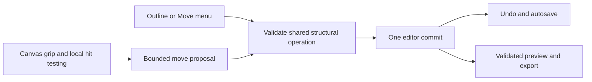

# Dragging sections and internal elements

Design proposal and implementation record · September 27, 2026.

## Implementation status

The four delivery stages below are implemented in the local editor, including
library insertion/replacement and a bounded Services ↔ Process transfer format.
Transfers require plain text items with no price, caption, image or custom icon,
an unlocked destination with spare capacity, and a non-colliding item ID. Other
card conversions and arbitrary nested trees are deliberately unsupported.

Hero images additionally expose an authored before/after-content placement and
an Edit image control. Canvas Move popups are positioned within the iframe viewport.
Feature icons and individual pricing-button icons can be replaced from the library.
Hero, split-about and gallery media support corner resizing and accessible numeric
size controls, with persisted width, optional height, image fit and reset. Resizing
requires an unlocked section and produces one Undo step. Canvas geometry remains
temporary until the parent accepts the bounded resize; saved sizes also render in
exports. About/gallery media can be selected for editing without introducing an
unsupported internal movement slot.
JEV now uses the same bounded movement and resizing rules. Its first pass chooses
up to four existing owner/action targets; the second chooses destinations or
image dimensions/fit. Stable item/part selection travels with the request. Item
reordering, compatible transfers and individual pricing-button icon replacement
are available alongside existing section and element controls. Applied-change
reports include image size, item order and ownership changes. Image bytes remain
outside model state, and requests still use at most two evaluation calls.

The original drag implementation was reviewed by source inspection only at the
user's request at that time. Subsequent deletion work adds automated and browser
verification described in `TEST-REPORT.md`; those checks cover their stated
scenarios, not the entire drag acceptance list below. The proposal's reasoning
and intended boundaries are retained below.

### Deletion integration

The same stable selection now supports Delete for sections, whole repeated items,
and authored inner parts. Navigation and hero are optional, and deleting the final
section leaves an editable, saveable empty page. The inspector lists available
parts with Delete/Restore controls; the canvas has a Delete button and guarded
Delete/Backspace shortcuts. Typing in inputs never triggers structure deletion.

Part deletion stores finite `removedParts` keys and omits actual markup from both
preview and export. Its saved copy remains available for Restore. Whole sections
and items are removed from their arrays and recoverable through Undo. Link repair
and section deletion share one history entry. Deleted parts leave movement choices,
and an explicit icon replacement restores only that icon. Locks, stale-frame
checks and composition busy state also govern deletion. Removing content cancels
active gestures; empty pages use nullable selection and retain Add controls.

## Recommendation

Make dragging a direct way to edit the same bounded composition that JEV uses.
Save relationships such as “before this section,” “third card,” and “icon before
label.” The renderer should derive responsive placement from those relationships.
This gives manual manipulation and JEV a common vocabulary, with portable export.

Implement three levels: page sections, repeated items, and authored inner slots.
The first two are array ordering; the third needs an extension to the current
fixed-slot data model. Simply enabling the browser's `draggable` attribute would
not provide persistent nested editing.

| Level | Gesture and result | Initial boundary |
| --- | --- | --- |
| Section | Drag its labeled handle or outline row; insert above/below another section | Current page, existing body-section order constraints |
| Card/item | Drag its own handle; reorder features, gallery entries, services, steps, plans or FAQ entries | Same repeated-item collection |
| Internal part | Select a button, icon or text part; drag to a compatible named location | Authored slots within its containing component |
| Library entry | Drag a catalog choice onto a compatible slot; insert or replace as the target explicitly indicates | Later stage, with an explicit cross-frame bridge |

Examples for the third level: move a hero action before/after its description;
place a feature icon above/beside the text group; move a button icon to the leading
or trailing side of its label. These placements must be catalog-supported values
that JEV can also select. A new layout choice must have saved data and a renderer.

## Interaction design

Use Inspect mode for arranging. Preserve Interact mode for experiencing the site.
Navigation links continue to navigate in both modes, as they do today.

- Show a section's grip in its selection label and in the page outline. Selecting
  a card reveals a separate card grip. A click selects; only a deliberate handle
  gesture starts a move. Text selection, links and form fields retain their behavior.
- Small parts need a selection breadcrumb, for example
  `Hero → Content → Primary button → Icon`. Choosing a breadcrumb changes the
  active drag level, avoiding overlapping section/card/element handles.
- On activation, show a small drag preview and a stable insertion line. Keep the
  original layout stationary until release initially; constant grid reflow makes
  the destination harder to predict. Later animation can improve this without
  changing the command semantics.
- Show one specific outcome: “Move Pricing before FAQ,” “Move this card to position
  2,” or “Place icon before label.” Highlight only compatible destinations. A
  nested valid destination takes priority over its parent.
- Auto-scroll near the relevant canvas or outline edges. Use actual rendered card
  rectangles for wrapped grids and featured cards, not a calculation assuming all
  cards have equal dimensions. Recalculate after scrolling or viewport changes.
- Escape, pointer cancellation, leaving the supported surface or a stale preview
  cancels cleanly. Suppress the click produced by a completed drag so it cannot
  activate a link or switch selection afterward.
- Every outcome also has a **Move…** menu: before/after a named sibling, first/last,
  or a compatible inner location. Announce the result and restore focus. Keyboard
  pickup/arrow/drop can be an additional shortcut. Touch handles need usable hit
  areas; apply touch-scroll suppression to handles only.

The explicit handles and outcome menus draw on Atlassian's
[design guidelines](https://atlassian.design/components/pragmatic-drag-and-drop/design-guidelines)
and [accessibility guidance](https://atlassian.design/components/pragmatic-drag-and-drop/accessibility-guidelines).
Puck documents selectable [drag preview behaviors](https://puckeditor.com/docs/api-reference/components/puck#behavior).
These are interaction references; this proposal adds none of their runtime packages.

## Data fixes needed before item dragging

Current sections already have stable IDs. Their array order controls rendering and
generated navigation, so moving a section should preserve its ID and all incoming
links. Repeated items have only array positions. See `shared/schema.mjs`,
`shared/icons.mjs`, `shared/render.mjs` and selection handling in `public/app.mjs`.

Add immutable item IDs, unique within each section, and use
`{pageId, sectionId, itemId}` for selection and move commands. Backfill absent IDs
deterministically during legacy normalization, avoiding existing IDs and preserving
idempotence. Give new items fresh IDs. Do not regenerate identity on rendering.
Keep ordinals as display labels; resolve them from current order for JEV context.
Inspector paths may still be computed indexes internally, but identity resolves
the index immediately before applying an edit.

Several current visuals are positional and need explicit decisions:

| Property | Current behavior | Proposed reorder behavior |
| --- | --- | --- |
| Default feature SVG | Derived from array index | Preserve the effective glyph on the moved item |
| Featured pricing plan | Default second item or selected ordinal | Follow the identified plan; migrate/remap the reference |
| Gallery placeholder artwork | Derived from array index | Travel with the card, like its uploaded image |
| Process/service number | Derived from array index | Renumber to express the new sequence |
| Leading bento/gallery card size | Determined by layout position | Stay with the leading layout slot; show that consequence in the preview |

The minimal reorder adapter can materialize effective icon/art defaults and remap
the highlighted-plan ordinal before moving. For the subsequent slot model, prefer
explicit item-owned visual values and a stable featured-item reference. Never
silently change an item's icon merely because its array position changed.

Undo snapshots should also retain selected page/section/item/slot. Today Undo
returns selection to Hero; a move Undo should follow the restored item and keep it
in view. One completed gesture is one Undo entry, regardless of pointer distance.

## One operation layer

Add shared pure operations, for example in `shared/structure.mjs`:

```text
moveSection(page, sourceSectionId, beforeSectionId | null)
moveItem(page, sectionId, sourceItemId, beforeItemId | null)
placePart(page, ownerRef, partKey, destinationSlot, beforePartKey | null)
canMove(page, proposal) → allowed or a concrete reason
```

Resolve insertion after removing the source, so downward movement is not off by
one. Moving before itself or back to its current position is a no-op. Return the
new selection alongside the resulting page. These functions are used by canvas
dragging, outline controls and Move menus. Compatible future JEV structural
choices should use the same validation rules.

Keep the current navigation-first, hero-first-body and footer-last behavior for
manual moves. The current schema alone does not enforce every composer/arrow
restriction, so the shared operation must enforce the stronger editing invariant.
Locked sections stay in their current structural slots; moves cannot cross them.
Proposed rule for the new controls: structural dragging inside a locked section
also requires unlocking. Ordinary manual text/icon/settings edits remain available;
this is not a general read-only mode. Label that distinction clearly.

Reject wrong-page targets, missing IDs, incompatible parents, self/descendant
placement, excessive item counts and unsupported nesting. Initially do not convert
a pricing card into a feature card through a drag. A later cross-container move
needs an explicit compatible item type or a lossless conversion policy.

## Preview and editor responsibilities

The iframe is sandboxed and scaled. Keep initial canvas hit-testing, indicators
and auto-scroll inside that iframe, in its own coordinate system. The editor owns
the specification and commits the result. It must not derive saved order by reading
or serializing rearranged preview HTML.



A bounded proposal carries only the source/destination IDs, allowed operation,
page ID, active drag-session token and starting local change counter. The parent
continues to check the iframe source, opaque origin and current channel, then checks
the proposal against current canonical state. IDs are references, not authority.
No HTML, scripts, URLs or arbitrary CSS selectors belong in this message.

Use the local content change counter for staleness. A completed background save
can update the project's persisted revision without changing the displayed content;
that alone should not invalidate a drag. Retain server revision checks for saving.

At drag start, ensure the displayed preview represents current state. Suspend pending
preview replacement and invalidate old render responses without destroying the
current channel. No model call, save or canonical spec mutation is needed on each
pointer movement. On drop, validate and call `commit()` once, then regenerate the
preview and restore scroll, selection and focus. A page switch, Undo, new composition,
resize that cannot be reconciled or project load cancels the active gesture first.
Composition-busy state prevents drag activation. Every cancellation releases capture,
stops scrolling and removes temporary feedback.

No new server API is needed for basic reordering. Existing whole-spec validation,
token/origin protections, autosave and export remain in use. Editor handles and
selection attributes remain preview-only; exported pages do not expose an editor.

## Input implementation

I recommend a small dependency-free Pointer Events controller for this bounded
editor. It provides one gesture path for mouse, touch and pen, explicit activation
thresholds, pointer capture and cancellation. Put `touch-action: none` on grips,
not the whole page. This is a design judgment, not a claim that native HTML drag
and drop cannot support nested targets. Native DnD remains a viable alternative,
especially for transfers between documents/applications, which this first stage
does not need. Neither API automatically implements the keyboard Move menu.
[Pointer Events](https://developer.mozilla.org/en-US/docs/Web/API/Pointer_events),
[HTML Drag and Drop](https://developer.mozilla.org/en-US/docs/Web/API/HTML_Drag_and_Drop_API).

Separate gesture mechanics from destination policy and state mutation. Keep work
per animation frame small. Drag sensors inside the preview and outline use the same
operation vocabulary without trying to read each other's DOM.

Dragging a library tile from the parent document into the iframe is a separate
integration stage. A parent-side capture/overlay can own the gesture and translate
its viewport coordinates into iframe-local coordinates, accounting for frame bounds
and scale. The child resolves compatible targets and returns semantic IDs. Validate
the final proposal in the parent. Test this deliberately; pointer capture alone is
not proof of correct cross-frame behavior. The current '+' and click-to-add paths
remain useful alternatives throughout.

## Smaller parts and JEV

The current `elements` object stores settings, not a child hierarchy. Introduce
catalog-defined slot metadata for internal movement: allowed part types, required
parts, cardinality, available placement choices and ordering. Reuse existing copy
and icon fields through named references before duplicating them into a second tree.
For example, a `primaryAction` references its saved label/icon and gains a bounded
location; `iconPlacement` has `leading`/`trailing` choices. A content stack can store
an allowed order of named parts with no duplicates and no missing required heading.

Render the selected order in actual HTML, so reading order, keyboard order and
export agree. Avoid storing a visual-only CSS order that disagrees with the DOM.
Keep initial placement consistent across breakpoints, with layout rules handling
stacking. Independent mobile ordering would require another explicit product feature.

As independent action instances become necessary, give them IDs and typed slots.
Only then enable multiple buttons and compatible moves between containers, with
depth/node limits and migration of selection, locks and JEV targeting together.
Dropping a library icon into an occupied icon slot is explicitly **Replace icon**;
dragging existing content between occupied slots must not silently overwrite it.

[Puck slots](https://puckeditor.com/docs/api-reference/fields/slot) and
[Craft.js component rules](https://craft.js.org/docs/api/user-component/) provide
useful precedents for allowed child types and movement rules. Forma should expose
these authored placement options to JEV through the same registry as the inspector.
A manual drag never needs a JEV request. A later “move the button above the
description” request should produce the same saved placement as dragging it there.

## Delivery sequence and acceptance

1. Add shared move operations and stable item identities; resolve positional visuals
   and selection history. Verify migration before enabling gestures.
2. Ship section and repeated-item dragging in canvas and outline, with Move menus,
   cancellation, auto-scroll and one-step Undo. Preserve navigation and page scope.
3. Add persisted authored placements for icons, buttons and text parts, selection
   breadcrumbs and matching JEV choices. This is essential to the requested element
   granularity; section sorting alone is not the completed design.
4. Add library-to-canvas insertion/replacement and compatible cross-container moves
   after explicit slot and identity contracts are established.

Acceptance must cover real pointer gestures in the scaled sandboxed iframe, not
only keyboard activation or synthetic drop messages. Test desktop/tablet/mobile
preview sizes, wrapped and unequal grids, edge scrolling, canceled/stale/replayed
drops, fixed/locked positions, busy composition, all six repeated-item families,
item identity/visual preservation, and no-op moves. Also verify Move menus, touch
scroll behavior, focus restoration, Undo/Redo, autosave/reopen, checkpoints, JSON
roundtrip, HTML reading order, links and export without editor controls.

The original proposal was based on source inspection and primary documentation.
The implementation adds no runtime dependencies. Drag tests have not been run.
